## 🦾 Version 1 – Finger C
This version is the **first test prototype** of the **third and final candidate finger**, identified as **Finger C**.  
**Fingers A and B** correspond to earlier design iterations and **are not shown in this collection**.

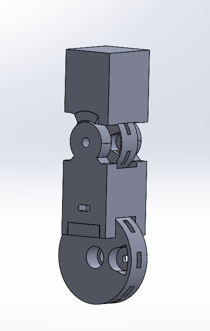
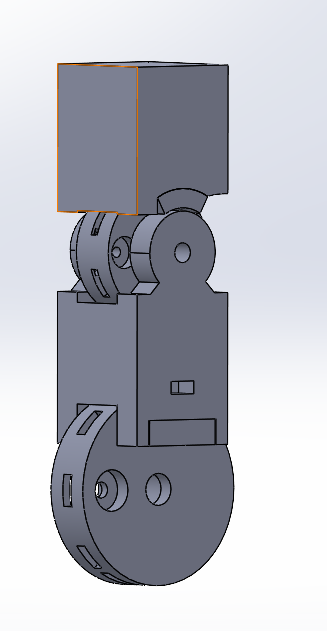
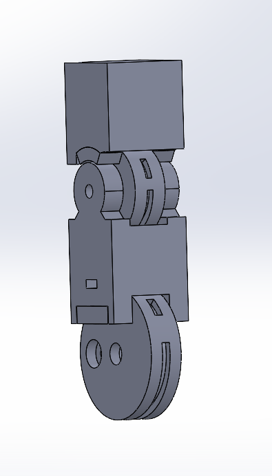

## 🦾 Version 3 – Finger C
In this version, progress has been made on the **DIP joint** and the **distal (final) part of the finger**.

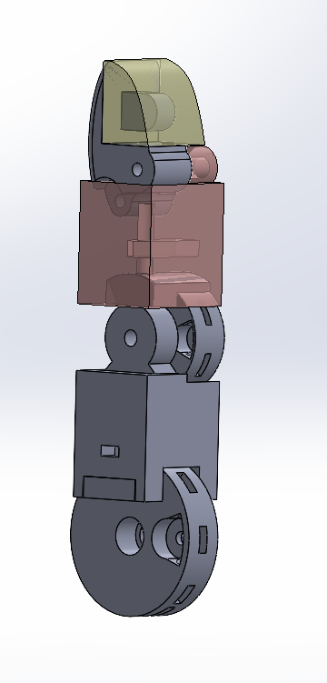
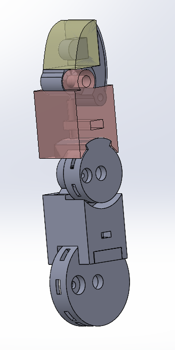
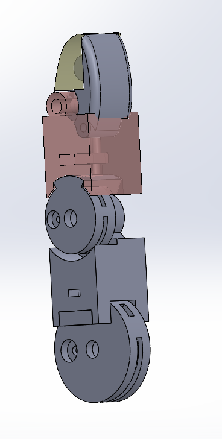

## 🦾 Version 5 – Finger C
In this version, the construction of the **articulated arm** that connects to the **fingertip (distal phalanx)** has begun.  
Each finger uses **two motors** to flex and extend the **MP** and **PIP joints**.  
However, to **save space** in the forearm — where the motors will be placed — and to **simplify the mechanism**, the **DIP joint** is designed to move through a **mechanical linkage** driven by the motion of the **PIP joint**. This will be well illustrated in future versions.

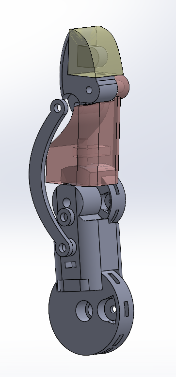
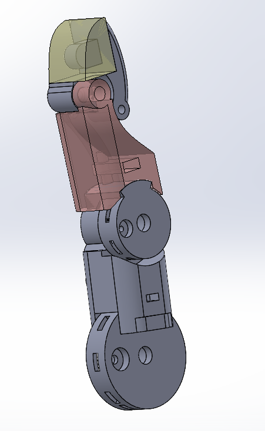
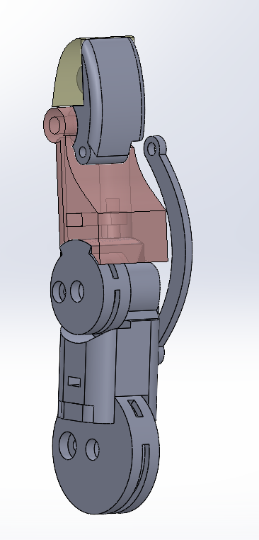

## 🦾 Version 7 – Finger C
By applying **geometry and technical drawing techniques** acquired during my **high school studies in Spain**, I was able to solve the problem of how to make the **distal phalanx** rotate.  
This was achieved through a **linkage mechanism**, where one arm acts as a **rotating lever**, and another fixed point on the **DIP joint** serves as a **pivot point**.
## 🔹 Dimensional Constraints

However, the linkage arm increased the **finger width** from **20 mm to 30 mm**, which would create problems when designing the **palm**.  
Most components have been designed to **closely match the proportions of my own hand**. The **width of my hand** is approximately **87 mm**.  

If, for example, I include **three fingers**, each with a width of **30 mm**, the total width of the palm would already be **90 mm**, and with an additional **10 mm spacing** between fingers, the palm would reach **110 mm**, not including other structures that would make it even larger.  

For this reason, in **future versions**, this issue is addressed in order to **prevent dimensional problems** in the final hand design.

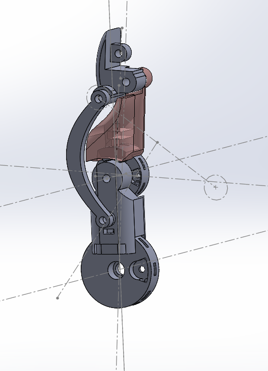
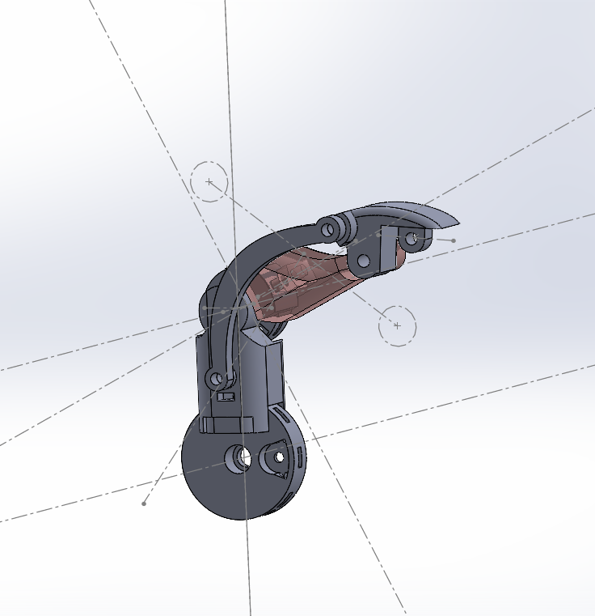
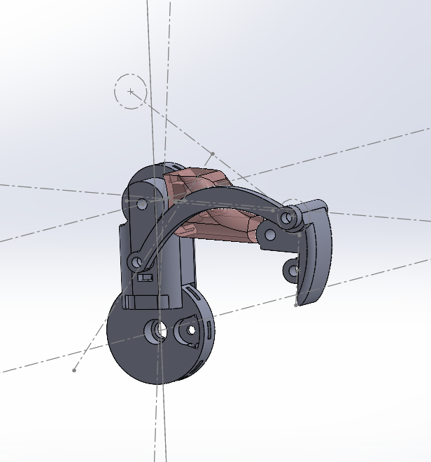
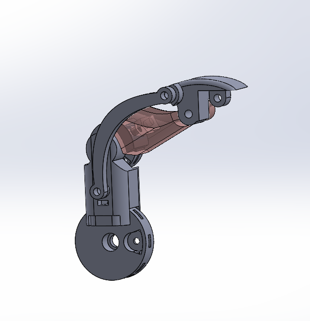
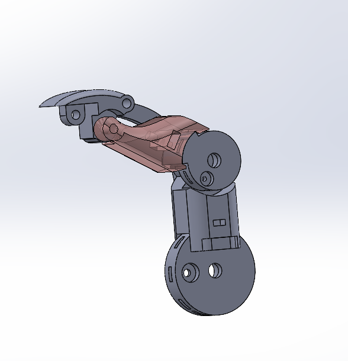
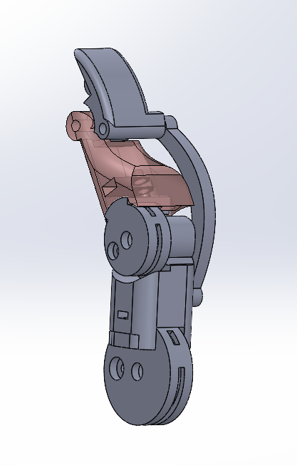

